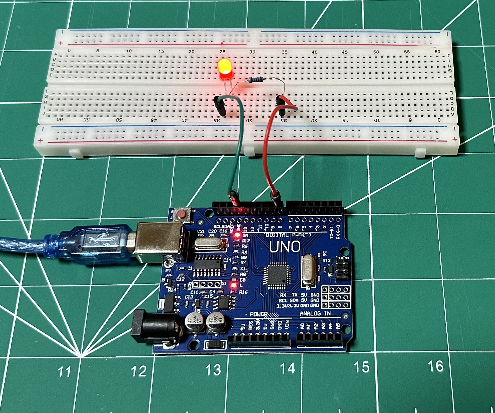

# LED Blinking with Serial Communication

## Description
This repository contains two versions of a basic project that blinks an LED connected to pin 8 and sends "Hello, World!" over the serial port every second:
- **Arduino IDE version**: Uses the Arduino framework and libraries for easy development.
- **Embedded C version**: Written in pure C, using AVR registers and timers directly for accurate timing and serial communication.

## Project Setup


## Hardware Requirements
- Arduino board
- LED and 220Ω resistor
- 2 Jumper wires
- Breadboard

## Files in the Repository

### Arduino Version
- **Path**: `arduino/hello_world/hello_world.ino`
- **Description**: This is the original Arduino IDE project. It blinks an LED connected to pin 8 and sends "Hello, World!" over the serial port every second using Arduino libraries.

### Embedded C Version
- **Path**: `src/`
- **Description**: This version uses AVR libraries and timers in pure C for the same functionality. No Arduino-specific libraries are used.
  - `src/main.c`: Main logic file.
  - `src/usart/usart.c` and `usart.h`: Handles serial communication using USART.
  - `src/timer/timer.c` and `timer.h`: Handles Timer1 for LED blinking.
  - `src/delay/delay.c` and `delay.h`: Provides accurate delay using Timer0.

## How to Use

### Arduino IDE Version
1. Connect the LED and resistor in series between pin 8 and ground.
2. Open the `arduino/sketch/hello_world.ino` file in the Arduino IDE.
3. Select the correct board and port from the **Tools** menu.
4. Upload the code to your Arduino board.
5. Open the Serial Monitor at 9600 baud to see the "Hello, World!" message.

### Embedded C Version (Pure C)

#### Prerequisites
- **GNU AVR Toolchain**: Make sure `avr-gcc`, `avr-libc`, and `avrdude` are installed.
- **Make**: For building the project using a `Makefile`.

#### Compilation and Upload Steps
1. Connect the LED and resistor in series between pin 8 and ground.
2. Clone or download the repository and navigate to the root directory.
3. **Modify the Makefile**: Open the `Makefile` and update the `AVRDUDE_PORT` line to use the correct port for your system.
   - For **macOS**, the port may look like `/dev/cu.usbserial-xxxx`.
   - For **Linux**, it could be `/dev/ttyUSB0` or `/dev/ttyACM0`.
   - For **Windows**, it might be `COMx` (where `x` is the COM port number).
   
   Example:
   ```makefile
   AVRDUDE_PORT = /dev/ttyUSB0  # Update this to match your system
   ```

4. Run the following commands to compile and upload the program:

   ```bash
   make clean        # Clean any previous build files
   make              # Compile the project and generate the .hex file
   make upload       # Upload the compiled .hex file to your Arduino board
   ```

5. Open your serial terminal or the Arduino IDE Serial Monitor at 9600 baud to see the "Hello, World!" message being printed every second.